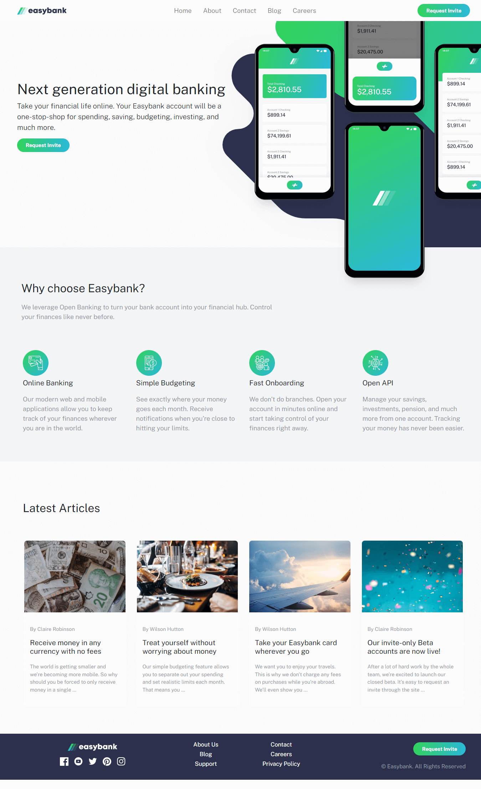

# Frontend Mentor - Easybank landing page

This is a solution to the [Easybank landing page challenge on Frontend Mentor](https://www.frontendmentor.io/challenges/easybank-landing-page-WaUhkoDN). 

## Table of contents

- [Design preview](#preview)
- [Screenshot](#screenshot)
- [Links](#links)
- [Built with](#built-with)
- [Author](#author)

### preview

### Screenshot

### Links

- Solution URL: [Solution URL](https://github.com/Ander-Tk/Easybank)
- Live Site URL: [Live URL](https://ander-tk.github.io/Easybank/)

## Built with

- HTML5
- CSS 
- [Sass](https://sass-lang.com/) - Sass
- [Bootstrap 5](https://getbootstrap.com/) - Bootstrap 5

## Author

- Frontend Mentor - [@Ander-Tk](https://www.frontendmentor.io/profile/Ander-Tk)
